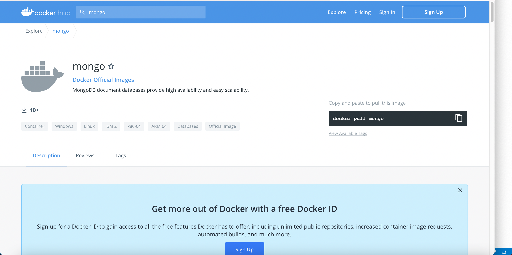
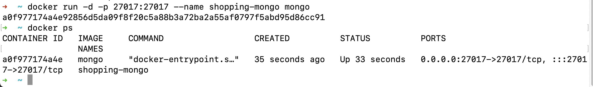

# Technical Details

### MongoDB
NOSQL database configurations and steps to achieve. We are going to setup Mongo DB with the help of **Docker**

To browse through Mongo DB server docker image, enter url
https://hub.docker.com

This will help to find all docker images for different tech's

Type ***mongo*** in search and locate mongo docker item

To check whether docker is running in our system
``` bash
docker ps
```
To pull mongo image from docker hub
``` bash
docker pull mongo
```

To run the Mongo image
``` bash
docker run -d -p 27017:27017 --name shopping-mongo mongo
```
- docker -> represents docker
- run -> run the image
- -d -> Running in detach mode
- -p -> Forwarding port number. MongoDB usually will be exposed through port number **27017** and we need to map that with our local port number which same in this case
- --name -> Name of the mongo db
- mongo -> Image name

now if you run and see 
``` bash
docker ps
```
then you will get output like this



If you want to see the logs of the docker then  following command can be used

``` bash
docker logs -f shopping-mongo
```
To drill down to particular container then we need to use following command

``` bash
docker exec -it shopping-mongo /bin/bash
```
This will open interactive (-it) mongo shell command
Following are the mongo commands
To see what does this container contains we can use ls
``` bash
ls
```
To see all the databases that mongo instance contains
``` bash
show dbs
```
To create a new database
``` bash
use CatalogDB
```
It will be switched to CatalogDB
To create a new collection
``` bash
db.createCollection('Products')
```
If you want to insert collection inside **Product** collection then we need to use following command
``` bash
db.Products.insert()
```
If you want to insert multiple then following command can be used
``` bash
db.Products.insertMany()
```
To see records in product collections then 
``` bash
db.Products.find({}).pretty()
```
To delete records in product collections
then
``` bash
db.Products.remove({})
```
To see different collections
``` bash
show collections
```

If we want to work with MongoDB in .NET core then we need to install
> MongoDB.Driver

